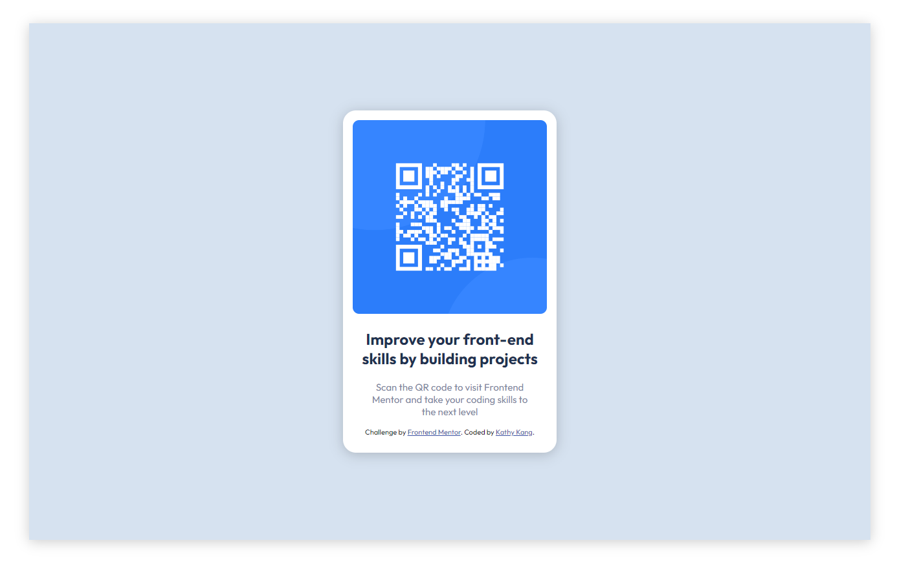
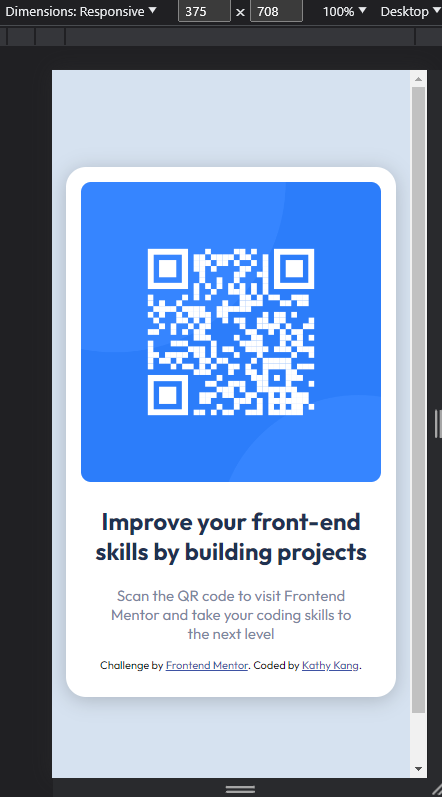

# Frontend Mentor - QR code component solution

This is a solution to the [QR code component challenge on Frontend Mentor](https://www.frontendmentor.io/challenges/qr-code-component-iux_sIO_H). Frontend Mentor challenges help you improve your coding skills by building realistic projects.

## Table of contents

- [Overview](#overview)
  - [Screenshot](#screenshot)
  - [Links](#links)
- [My process](#my-process)
  - [Built with](#built-with)
  - [What I learned](#what-i-learned)
  - [Useful resources](#useful-resources)
- [Author](#author)

## Overview

### Screenshot

### Links

- Solution URL: [Solution](https://www.frontendmentor.io/solutions/qr-code-component-css-grid-and-flex-OsIcDyQt1Q)
- Live Site URL: https://katskang.github.io/QR-Code-Component/

## My process

### Built with

- Semantic HTML5 markup
- CSS custom properties
- Flexbox
- CSS Grid
- Mobile-first workflow

### What I learned

- Great refresher for CSS grid and flexbox.
- A tip I found online was to outline your elements with a red border to make is easier to visualize, which I found helped a lot for me personally.

### Useful resources

- W3Schools
- MDN

## Author

- GitHub - [KatSKang](https://github.com/KatSKang)
- Frontend Mentor - [KatSKang](https://www.frontendmentor.io/profile/KatSKang)
